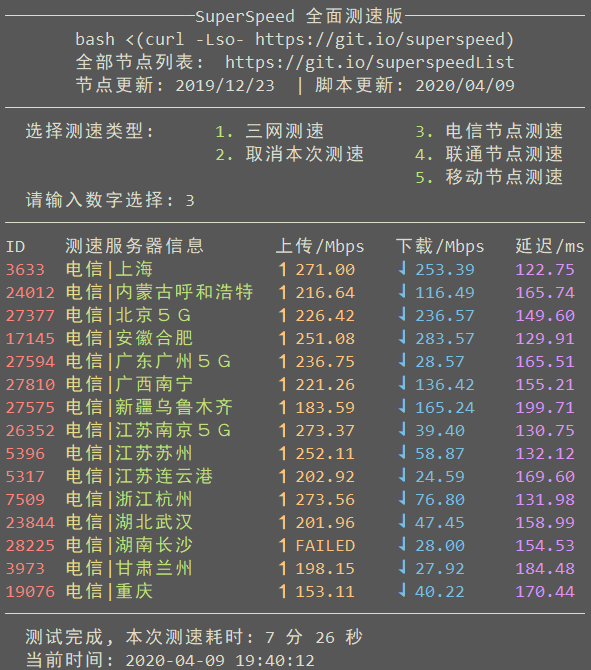

## Superspeed
Superspeed.sh with updated server lists.

## Usage
```
bash <(curl -Lso- https://git.io/superspeed)
```

[查看全部节点列表](https://git.io/superspeedList)



---

Modified from Oldking's script. Original Info:
- Description: Test your server's network with Speedtest to China
- Copyright (C) 2018 Oldking <oooldking@gmail.com>
