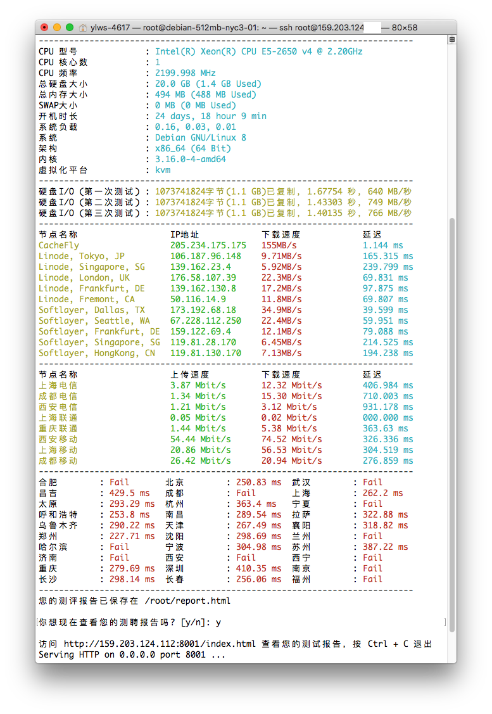

# Zench

又一个Linux VPS测评脚本

## 说明

平时测试VPS的时候一直是靠着 **Bench.sh** 来测试的，最近看到 **Oldking**大佬 的 **SuperBench** 也很方便。我自己把这两者的脚本结合在一起，然后加入 **Ping** 以及 **路由测试** 功能。比较懒人，简单快捷。方便VPS测评站的朋友们使用。因为会生成测评报告，可以很方便地分享给其他朋友看自己的测评数据。

示例(Demo)：[https://www.zhujiboke.com/zbench-example.html](https://www.zhujiboke.com/zbench-example.html)

## 脚本命令

如果中文版出现乱码等情况，请换成英文版。

中文版：

    wget -N --no-check-certificate https://raw.githubusercontent.com/FunctionClub/ZBench/master/ZBench-CN.sh && bash ZBench-CN.sh
    
英文版：

    wget -N --no-check-certificate https://raw.githubusercontent.com/FunctionClub/ZBench/master/ZBench.sh && bash ZBench.sh
    
## 效果图

## 引用

* Bench.sh ( [https://teddysun.com/444.html](https://teddysun.com/444.html) )
* SuperBench ( [https://www.oldking.net/350.html](https://www.oldking.net/350.html) )
* python实现ping程序 ( [https://www.s0nnet.com/archives/python-icmp](https://www.s0nnet.com/archives/python-icmp) )
* Python 设置颜色 ( [http://www.pythoner.com/357.html](http://www.pythoner.com/357.html) )
* Kirito's Blog ( [https://www.ixh.me](https://www.ixh.me) )

